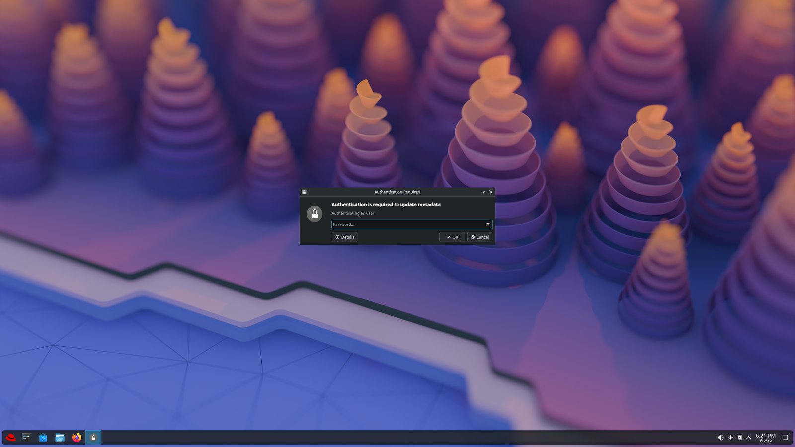

# kde-plasma-wslg-rpm

A full **KDE Plasma 6 Wayland desktop, running full-screen inside a WSLg window**, on a
RHEL 10 (or EL10-compatible) WSL distro — packaged as a signed dnf repo so `dnf upgrade`
is the whole update story.



Rendering is CPU-only (llvmpipe). GPU acceleration is **not possible** under WSLg's
compositor — see [`docs/gpu.md`](docs/gpu.md) for the (thorough) proof.

## Install

```bash
# 1. add the repo (priority=1, GPG-verified)
sudo dnf install https://denney-tech.github.io/kde-plasma-wslg-rpm/el10/noarch/kde-plasma-wslg-repo-latest.noarch.rpm

# 2. install the desktop (pulls the patched kwin from the repo)
sudo dnf install kde-plasma-wslg

# 3. run it
plasma-wslg start
```

- Comes up full-screen over the whole Windows display. **Alt+Tab** (Windows) switches away;
  the **right Ctrl** key releases the mouse-pointer grab.
- `plasma-wslg stop` / `plasma-wslg status`; logs: `journalctl --user -u plasma-wslg -f`.
- Windowed instead of full-screen: `systemctl --user edit plasma-wslg` and add
  `Environment=KWIN_WSLG_NO_FULLSCREEN=1`.
- Updates: `dnf upgrade` — the repo has `priority=1`, so its patched `kwin` always wins over
  a stock build and the patch is never silently reverted.

## What's in the box

| package | contents |
|---|---|
| `kde-plasma-wslg-repo` | the dnf `.repo` file (GitHub Pages, priority=1) + signing key |
| `kwin` / `kwin-libs` / `kwin-common` `-*.wslgN` | EPEL's `kwin`, rebuilt with the WSLg nested-Wayland fixes and a wrapper that sizes + full-screens the nested session |
| `kde-plasma-wslg` | `plasma-wslg` control command, session launcher, systemd **user** service, a tmpfiles.d rule for `/tmp/.X11-unix`, and a system `kscreenlockerrc` (autolock off) |

## Why a kwin patch is needed

WSLg's compositor (`weston-rdprail`, Weston 9) is missing a lot, and stock KWin can't run
nested under it — you get a black window. The patch (`packaging/kwin/wslg-kwin-rail.patch`,
applied as `Patch1000`) detects `weston_rdprail_shell` and, only then:

- paints the desktop **onto the toplevel surface** instead of a subsurface (weston-rdprail
  doesn't stream subsurface content for RAIL windows);
- gives the toplevel a **real full-size background buffer** (it can't `wp_viewport`-scale a
  1×1 one for a RAIL window);
- runs a **1 Hz heartbeat repaint** so weston-rdprail doesn't stop streaming an idle window.

Everything is gated on `hasRdpRailShell()`, so a normal nested KWin is unaffected. Full
story, including the four *other* problems that had to be solved first (llvmpipe, QPainter,
software QtQuick, autolock): [`docs/design.md`](docs/design.md).

## Building / maintaining

`make rpms` (on an EL10 host, or `podman run quay.io/rockylinux/rockylinux:10`), or let CI
do it. Upstream kwin tracking, the release flow, and signing are in
[`MAINTAINING.md`](MAINTAINING.md); contribution setup is in
[`CONTRIBUTING.md`](CONTRIBUTING.md).

## License

GPL-2.0-or-later — see [`LICENSE`](LICENSE). The kwin patch is a derivative of KWin
(GPL-2.0-or-later); the packaging and scripts are released under the same terms.
